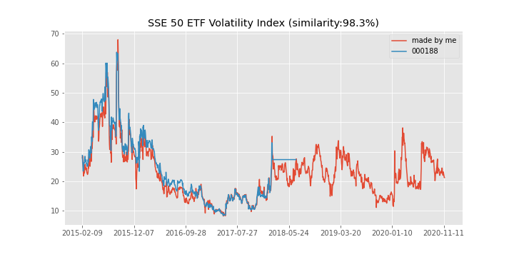

# 中国波指（000188）编制
中国波指编制；中国波动率指数；复现中国波指000188；python；
# 中国波指介绍
上证 50 ETF 波动率指数是基于上海证券交易所挂牌的 50 ETF 期权合约编制而成，反映投资者对未来 30 天 50 ETF 波动率的预期。上证 50 ETF 波动率指数不仅是反映投资者情绪的重要指标，也是衍生产品的重要标的，可作为投资者管控风险的有力工具。由于种种原因，中国波指在2018年停止发布。
- 指数名称：上证 50 ETF 波动率指数 
- 指数简称：中国波指 
- 英文名称：SSE 50 ETF Volatility Index 
- 英文简称：iVX 
- 指数代码：000188
## 计算方法
上证 50 ETF 波动率指数是基于方差互换原理，采用上证 50 ETF 期权相关数据计算而得。具体计算方法参考中证指数有限公司分布的《上证50ETF波动率指数编制方案》。
## 指数复现
由于种种原因，中国波指在2018年官方停止发布，本项目利用python和期权数据，严格按照中国波指官方编制方案，对中国波指进行复制，目的是为了可以获得最新的中国波指数据，方面投资者进行风险管控。
### 数据来源
wind数据库，上证50ETF期权日度数据
### 方法
python+《上证50ETF波动率指数编制方案》
### 结论
复现的波动率指数和中国波指相似度高达98.3%，达到实践可用水平。如图1.
